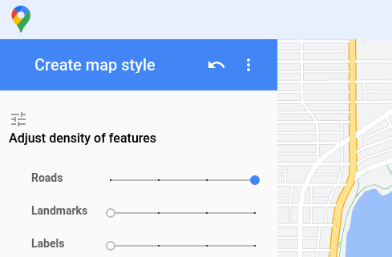

# Road network detection 

The Road network detection algorithm needs "clean" Maps Screenshots without landmarks, buildings, any labels or markers. You can use screenshots of google map from https://mapstyle.withgoogle.com/ with the following settings:


See example output in `/z-output`.
## Usage
```python
$ python3 main.py <path-to-image>
# python3 main.py ./z-input/kirba.png       # for example
```

## Requirements
Used python v3.10.6
```
# requirements.txt

cv-algorithms==1.0.4
networkx==3.0
numpy==1.21.5
opencv-python==4.7.0.68
```

## Implementation

1. **Road Detection**
   - Load the "clean" map screenshot. You can not use simple thresholding to detect all the roads because highway roads belong to a different color space than regular roads. So, use HSV color space to detect the highway roads (Ref [this](
https://stackoverflow.com/questions/50210304/change-the-colors-within-certain-range-to-another-color-using-opencv)). Then, use the mask image generated using the HSV color space to replace the highway roads with white color. 

   - Use thresholding to detect the roads (our ROI) apart from non-white areas (like water bodies and other non-road areas). 

1. **Road Graph Network Detection**
   - You can not detect nodes from the image because a lot of nodes will be formed at road intersection points because the road lines are thick. So, first use the Guo-Hall thinning algorithm to perform thinning operation on road network to detect nodes.
   - Use Zhang-Suen node detection algorithm to detect nodes from the thinned network.
   - Use BFS edge detection algorithm to detect edges from the thinned network.
   - Plot the graph data structure on the original image. See `/z-output/graph.png`

## References
- NEFI2 
  - https://nefi.mpi-inf.mpg.de/guide.php
  - https://www.nature.com/articles/srep15669#Sec5
